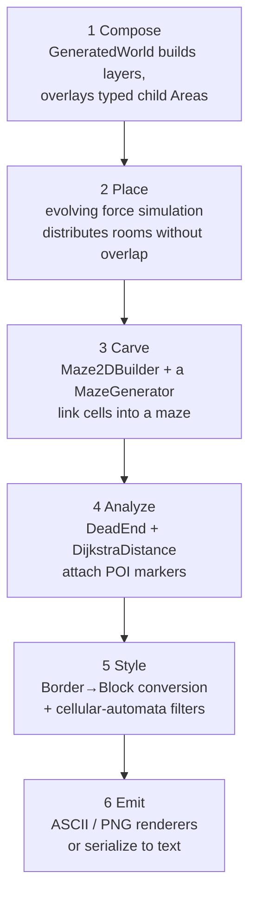
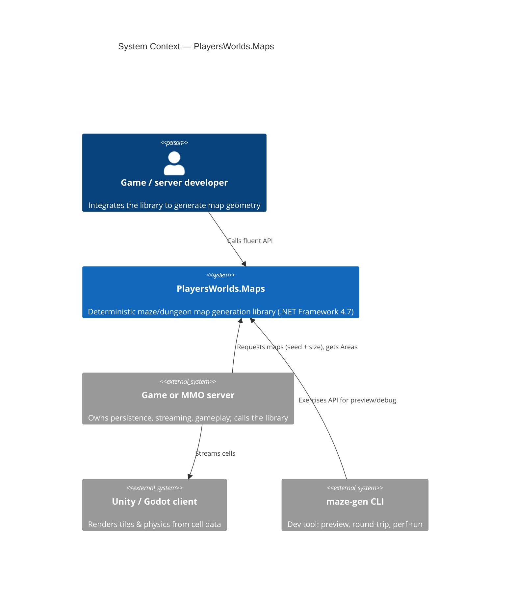
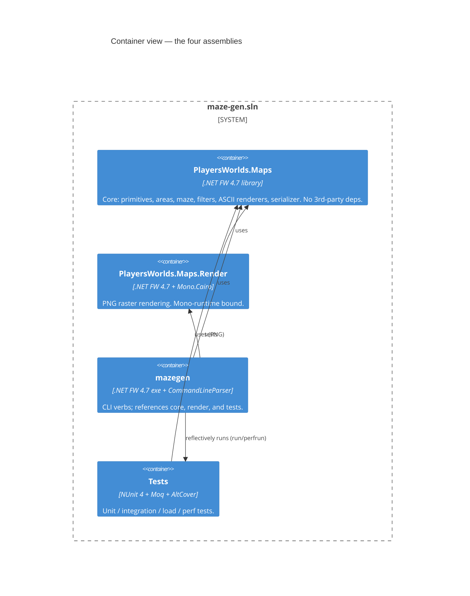
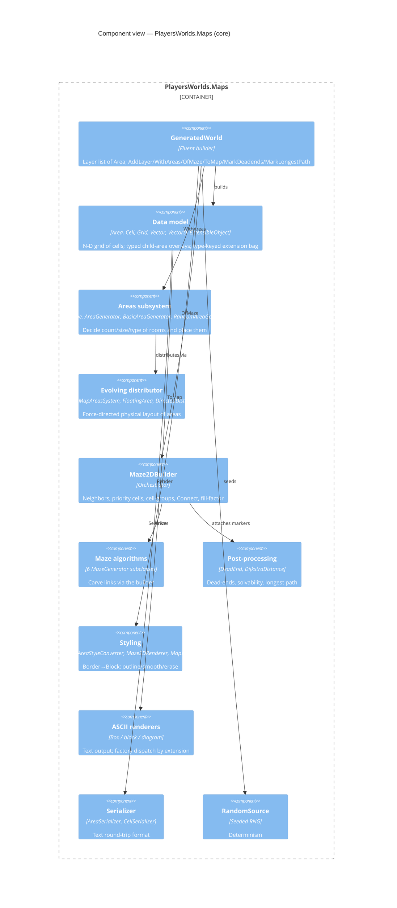
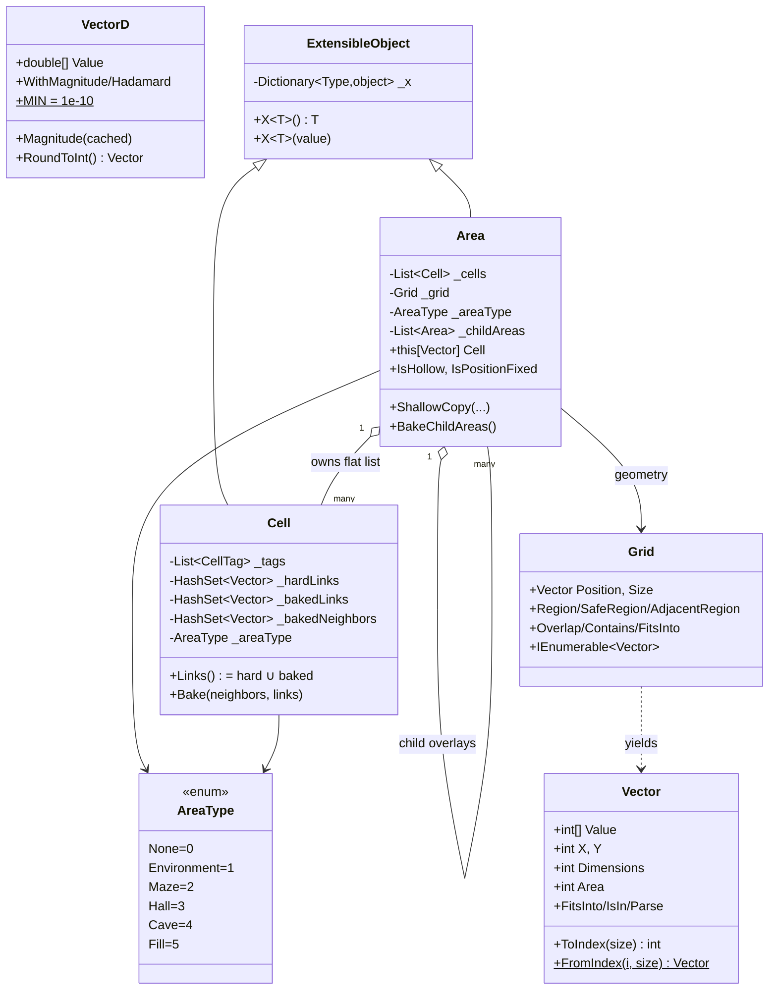
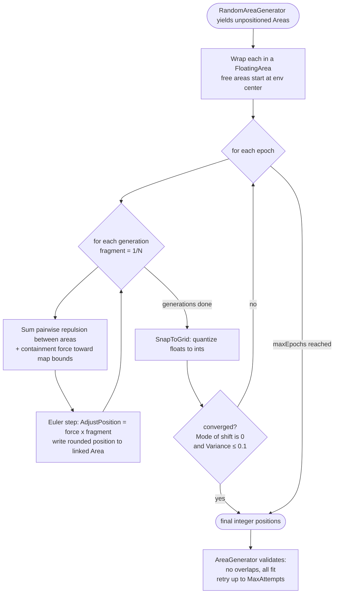
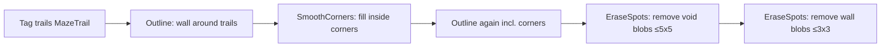

# Design Document — PlayersWorlds.Maps

> **Status:** Reverse-engineered from source (v0.2, branch `circles`).
> **Scope:** Architecture, public API, algorithms, data model, quality attributes, and the C4 view of the system.
> Companion documents: [PRD.md](PRD.md) (why), [COMPONENT-REVIEW.md](COMPONENT-REVIEW.md) (per-component detail & defects).

---

## 1. Architectural overview

`PlayersWorlds.Maps` is a **staged generation pipeline** over a shared data model. Each stage transforms an `Area` (a grid of `Cell`s) and hands it to the next through a narrow contract. This separation is why six maze algorithms, three area generators, and four renderers coexist without entangling.



### 1.1 Design principles observed in the code

1. **Algorithms are ignorant of complexity.** A `MazeGenerator` only ever calls `builder.Connect(a, b)` guided by `builder.IsFillComplete()`. All the hard parts — which cells are connectable, how halls/caves/fill are respected, how isolated regions are seeded — live in `Maze2DBuilder`. Adding an algorithm means implementing one method.
2. **Authored vs. derived state is separated.** A `Cell` keeps `HardLinks` (carved by algorithms, permanent) apart from `BakedLinks`/`BakedNeighbors` (recomputed from the overlay of child areas). Baking never touches hard links.
3. **Type = priority.** `AreaType` enum values *are* the precedence used when overlapping areas are flattened (`Fill` > `Cave` > `Hall` > `Maze` > `Environment` > `None`). One ordering drives the whole overlay resolution.
4. **Determinism is a first-class constraint.** Nothing calls `new Random()`; a seeded `RandomSource` is threaded through every generator, and seeds surface in exceptions so any failure is reproducible.
5. **Copy-on-write layering (aspirational).** `GeneratedWorld` keeps a `List<Area>` of layers; new layers derive from the last via `ShallowCopy`. *Caveat:* `ShallowCopy` shares the underlying cell/child lists, so true isolation requires the caller to clone cells — a known hazard (see review).

---

## 2. C4 model

### 2.1 Context



### 2.2 Containers



### 2.3 Components (core library)



---

## 3. Data model



**Key model facts**

- **`Grid` is pure geometry** (position + size + iteration). It stores *no cells* — the flat `List<Cell>` lives on `Area`, indexed by `Vector.ToIndex` (dimension 0 fastest-varying). `Grid` is the former `NArray`, renamed and stripped of payload during the v0.2 refactor.
- **A cell does not know its own coordinate** — position is implied by its index in `Area._cells`. Links/neighbors are stored as `Vector`s pointing at other cells.
- **`ExtensibleObject`** attaches one value *per `Type`* to an `Area`/`Cell`. This is how post-processing results (`DeadEndsExtension`, `LongestTrailExtension`) and the `Maze2DBuilder` itself ride along on the `Area` without new fields. It's a service-locator-on-an-entity: flexible, but one-value-per-type and weakly typed.
- **`BakeChildAreas`** flattens overlapping child areas into per-cell availability + baked neighbors/links using the `AreaType` priority ordering (`None` seeds unavailability, `Fill` forces it, `Maze` cells become the neighbor graph, hollow `Hall`/`Cave` interiors get linked).

---

## 4. Public API

The entry point is the fluent **`GeneratedWorld`** builder. Every method returns `this`.

```csharp
var map = new GeneratedWorld(RandomSource.CreateFromEnv())
    // 1. seed a layer
    .AddLayer(AreaType.Maze, new Vector(width, height))
    // 2. overlay areas (manual or procedural)
    .WithAreas(
        new[] { AreaType.Hall, AreaType.Cave },
        tags: new[] { "room", "cave" },
        count: 4, minSize: new Vector(2,2), maxSize: new Vector(6,6))
    // 3. carve the maze around the areas
    .OfMaze(MazeStructureStyle.Block, new GeneratorOptions {
        MazeAlgorithm = GeneratorOptions.Algorithms.RecursiveBacktracker,
        FillFactor    = GeneratorOptions.MazeFillFactor.Full,
    })
    // 4. analyze
    .MarkDeadends()
    .MarkLongestPath()
    // 5. style (Border topology → explicit Block/wall grid)
    .ToMap(Maze2DRendererOptions.RectCells(3, 2))
    // 6. terminal
    .Map();                    // -> Area
```

### 4.1 `GeneratedWorld` surface

| Method | Purpose | Notes |
|--------|---------|-------|
| `AddLayer(type, [position,] size)` | Push a fresh `Area` layer | Position defaults to zero |
| `AddLayer(Func<Area,Area>)` | Derive a new layer from the current one (recursively re-parents child areas) | Enables maze-within-a-maze |
| `AddLayer()` | Push `CurrentLayer.ShallowCopy()` | Copy-on-write clone |
| `WithAreas(params Area[])` | Attach fixed child areas | Basis for stitching/aligning |
| `WithAreas(types, tags, count, min, max)` | Procedurally generate & place child areas | Uses `BasicAreaGenerator` |
| `OfMaze(style, options)` | Carve the maze (recurses into child areas containing Maze cells) | `Border` or `Block` style |
| `MarkDeadends()` | Attach `DeadEndsExtension` | Requires a built maze layer |
| `MarkLongestPath()` | Attach longest-path start/end | 🚧 tagging bugs (see review) |
| `ToMap(options)` | Convert Border topology → Block grid | Runs the filter pipeline |
| `WithElevation(min,max)` | — | ❌ throws `NotImplementedException` |
| `AddEnvironmentAreas(tags)` | — | ❌ no-op stub |
| `Map()` / `Serialize()` | Terminals | `Area` / text |

### 4.2 `GeneratorOptions`

- `MazeAlgorithm` — a `Type` handle from `GeneratorOptions.Algorithms` (default `RecursiveBacktracker`).
- `FillFactor` — `Full | FullWidth | FullHeight | Quarter | Half | ThreeQuarters | NinetyPercent`. Binary Tree and Sidewinder require `Full`.
- `AreaGeneration` — `Manual` (areas on the `Area`) vs `Auto` (via an `AreaGenerator`).
- `MazeStructureStyle` — `Border` (thin walls) vs `Block` (walls occupy cells).
- `MazeRendererOptions` — trail/wall cell sizes for Border→Block expansion.
- `RandomSource` — seeded RNG (auto-filled from env if null).

---

## 5. Algorithms

### 5.1 Maze carving

All six express themselves purely through `Maze2DBuilder`. A "link" is one `builder.Connect(a,b)` (adds each cell to the other's `HardLinks`).

| Algorithm | Idea | Bias / trait | Fill factors |
|-----------|------|--------------|--------------|
| **Recursive Backtracker** (default) | DFS carve with explicit stack; backtrack at dead-ends | Long winding corridors, few dead-ends | All |
| **Aldous-Broder** | Uniform random walk; carve on first visit | Unbiased uniform spanning tree; slow; short reach | All (re-seeds on idle) |
| **Hunt-and-Kill** | Random walk ("kill"), then scan for an unvisited cell adjacent to visited ("hunt") | Moderate corridors | All |
| **Wilson's** | Loop-erased random walk into the visited set | Unbiased uniform spanning tree; seeds one cell per isolated group | All |
| **Binary Tree** | Per cell (row-major), carve North or East | Strong diagonal bias; full N & E border corridors | `Full` only |
| **Sidewinder** | Per row, build eastward runs, close each with a random North carve | Unbroken top-row corridor | `Full` only |

**Isolation handling** (mazes split into disconnected regions by areas) is centralized in the builder's `_cellGroups` (connected components found via `DijkstraDistance.FindRaw`). Wilson's seeds one visited cell per group; random-walk algorithms re-seed via `PickNextCellToLink` when idle; ordered algorithms brute-force-connect any orphaned cell.

### 5.2 Area placement — force-directed distribution

The `evolving` subsystem lays out rooms with a **spring/repulsion physics simulation** so they spread out and don't overlap, while never moving user-fixed areas.



**Force laws** (`DirectedDistanceForceProducer`):
- **Repulsion** has a *bounded, short range*: `NormalForce(x) = 0 if x≥3; 3 if x≤0; else 3−x`. This 3-unit cutoff is why areas spread apart but don't fling to infinity.
- **Overlap** (penetration) uses a stronger `OverlapForce`. Perfectly-coincident areas (identical centers) get an *exploding* random-direction push, cached so the pair receives exactly opposite forces.
- **Containment** sums pushes from all four walls: strongly inward when an edge is outside the map, gently attractive when inside.

**Determinism note:** the distributor tolerates an under-1% statistical failure rate and *retries* (`AreaGenerator.MaxAttempts = 3`); the load test asserts ≥990/1000 layouts succeed.

### 5.3 Border → Block styling

A **Border** maze stores topology only (a passage = a link between adjacent cells; walls are implicit). `MazeAreaStyleConverter.ConvertMazeBorderToBlock` expands it into a **Block** grid where walls occupy their own cells, then runs a cellular-automata-style filter chain to make it look natural:



### 5.4 Post-processing analysis

- **Dead-ends** — cells with exactly one link (`DeadEnd.Find`); tagged as loot-spot candidates.
- **Solvability & distances** — `DijkstraDistance` (relaxation BFS over links; note it uses a LIFO stack, so it's DFS-order but still converges to correct shortest distances).
- **Longest path** — double-BFS diameter approximation for start/end markers (guaranteed longest path). 🚧 *The end marker and trail cells are currently mis-tagged onto the start cell — see the component review.*

---

## 6. Cross-cutting concerns

| Concern | Mechanism |
|---------|-----------|
| **Randomness** | `RandomSource` (seeded `System.Random` wrapper); `EnvRandomSeed` global pin; usage logged at debug level 4 |
| **Extensibility** | `ExtensibleObject` type-keyed bag; `MazeGenerator`/`Map2DFilter`/`AreaRenderer` single-method abstract bases |
| **Error handling** | Domain exceptions (`MazeBuildingException`, `AreaGeneratorException`) carry the builder/generator and RNG state for reproducible bug reports; loop guards bound runaway generation |
| **Logging** | `Log` (quick console logger, level-gated; `WriteEvery` throttling). Not a production framework; not thread-safe |
| **Coordinate convention** | Internal Y-up; every renderer flips to Y-down for output (duplicated per renderer) |

---

## 7. Technology & constraints

- **Runtime:** .NET Framework **4.7** (Unity compatibility — later runtimes unsupported). Built with Mono on Linux; MSBuild + `packages.config` (non-SDK projects).
- **Core library dependencies:** none beyond BCL (deliberate — must drop cleanly into Unity).
- **Render project:** `Mono.Cairo` (binds it to the Mono runtime; preview-only).
- **CLI:** `CommandLineParser` 2.9.1.
- **Tests:** NUnit 4.1, Moq 4.20 + Castle.Core, AltCover 8.8 (coverage), ReportGenerator, Gendarme (static analysis).
- **Distribution:** drop `PlayersWorlds.Maps.dll` into Unity assets (README).

---

## 8. Known design tensions (for future refactors)

1. **Immutability is aspirational.** `Area.ShallowCopy` shares `_cells`/`_childAreas` references → mutating a "copy" can bleed into the original. True copy-on-write needs `Cell.Clone()`. This is the biggest structural hazard.
2. **Tags are weakly typed.** `CellTag` is a string wrapper; the author's own `Cell.md` note debates a strongly-typed "cell content" field vs. the flexible-but-confusing tag list. Border-style needs *links*; Block-style needs *content* — the tag set conflates them.
3. **N-D generality is half-built.** Iteration is N-D; `Grid.Overlap/Contains/Low/High`, the compass constants, and comparers are 2D-only.
4. **`BakeChildAreas` recomputes redundantly** (author's TODO: "Why is this called 3-4 times?").
5. **Three near-identical `Render()` abstract bases** across three namespaces (one of which *mutates* rather than renders) — naming/abstraction inconsistency.

See [COMPONENT-REVIEW.md](COMPONENT-REVIEW.md) for defect-level detail with `file:line` references.
