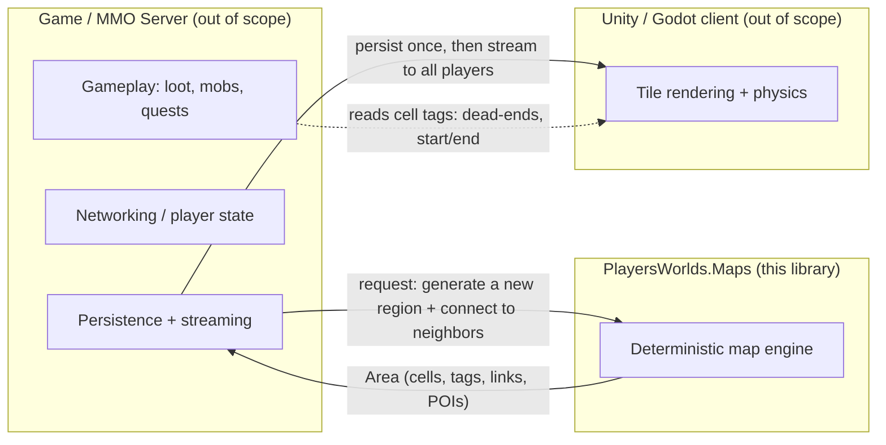
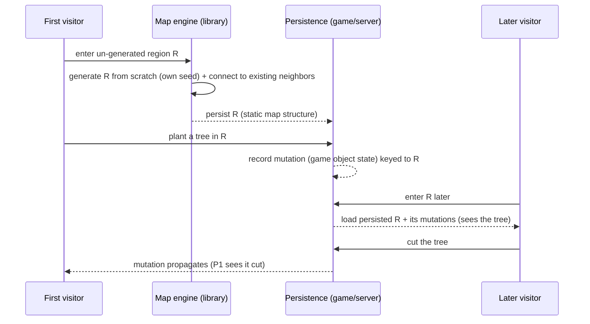

# Product Requirements Document — PlayersWorlds.Maps

> **Status:** Living document, reverse-engineered from the codebase (v0.2, branch `circles`) blended with the stated product vision.
> **Audience:** Library maintainers, game developers integrating the library, and future contributors.
> **One-line:** A procedural map-generation library that produces the *backbone* of maze/dungeon worlds for 2D/3D games — corridors, rooms, halls, caves, and impassable zones — while leaving the actual game content to the consuming game.

---

## 1. Vision

The long-term product is an **endless, dynamically generated maze/dungeon world** for an MMO RPG. The defining properties of that world are:

- **Lazy generation.** Areas that no player has visited do not exist yet. They are generated on demand, once, when the first player reaches them.
- **Generate once, persist, share.** The moment an area is generated it becomes **static, persisted state**. Every later visitor loads *that* generated map — nobody re-generates it. The world is not a pure function of coordinates; it is authored-by-generation and then stored. (In-place mutations layer on top — see §1.2.)
- **Independent generation, then stitching.** A new region is a **fresh generation from scratch with its own seed** — *not* a slice of one big same-seed maze. When it is created it must **connect** to whatever already-generated neighbors it touches (entrances line up with entrances). Regions grow the world outward like tiles that were each drawn separately and then joined at the seams.
- **Organic growth.** New communities or "countries" start in fresh, disconnected regions. As players explore, those regions stitch to the ones they meet, eventually merging separate islands into one massive shared world.

`PlayersWorlds.Maps` is **not** that server. It is the **map backbone library**: the engine a game server (or the client itself) calls to **generate a new region and connect it to its neighbors**. The game owns persistence, networking, gameplay, loot, mobs, mutations, and the visual layer. The library's job is: *"generate a correct, connectable region here, once."* Determinism still matters *within* a single generation (reproducible tests/bug reports from a seed), but the world's consistency comes from **persistence**, not from regenerating the same coordinates.

### 1.1 What "backbone" means concretely

The library produces an **`Area`**: an N-dimensional grid of **`Cell`s**. Each cell carries:

- an **`AreaType`** (maze corridor, hall, cave, fill/impassable, environment),
- **links** to neighboring cells (the actual carved passages — this *is* the maze topology),
- **tags** describing block-level content once styled (wall, trail, wall-corner, void),
- **markers** attached during post-processing: dead-ends (good loot spots) and the guaranteed longest path's start/end cells (good spawn/exit points).

The consuming game iterates the cells and decides what to draw and spawn. The library guarantees the *structure* (solvable maze, rooms with entrances, impassable zones respected); the game supplies the *meaning*.

### 1.2 World model & persistence lifecycle

The unit of the world is a **region**: an independently-generated `Area` with a coordinate address. Its lifecycle:

**Responsibility boundary — critical for the API contract:**

- **Map engine (this library) owns:** generating a region, guaranteeing it is a correct/solvable map, **connecting it to already-existing neighbors** at shared borders, and defining the region as a serializable unit with a stable coordinate address and per-cell identity.
- **Game / server owns:** the persistence store itself, and all **in-place mutations** (a planted or cut tree, opened doors, placed loot). Mutations are game-object state *keyed to* the engine's region identity + cell coordinates; the engine does not model trees, but its region/cell identity must be stable enough for the game to key mutations to it across loads.

This is why **persistence** and **seam-stitching** — not coordinate-deterministic regeneration — are the load-bearing capabilities: the world is consistent because it is *stored*, and it is one world because regions are *connected*, even though each was generated independently.

---

## 2. Personas & user journeys

### Persona A — "Backbone integrator" (game/server engineer)
Builds the MMO server. Wants a deterministic API to generate map regions from a seed, persist them, and stream them. Cares about reproducibility, serialization, and the ability to place rooms at fixed world coordinates so generated regions line up.

**Journey — generate and persist a starting zone:**
1. Server receives "new community needs a starting zone at world offset (2000, 2000)."
2. Server calls the library with a seed and a region size, requesting a maze layer with auto-placed rooms/halls/caves.
3. Library returns an `Area`; server serializes it (`Area:{…}` text format) and stores it keyed by region coordinates.
4. As players move, server streams cells; client renders walls/floors from cell tags and places loot on dead-end markers.

**Journey — stitch a newly explored region to existing map (vision / partially supported):**
1. A player walks off the edge of a generated region.
2. Server generates the adjacent region, passing the already-fixed border cells of the existing region as **fixed areas** so the new maze connects rather than overlaps.
3. New region persists and connects; the two "countries" are now one world.
   *(Today: fixed-position `Area`s and the force distributor's "never disturb fixed areas" rule are the building blocks for this. A first-class "stitch adjacent region" API does not yet exist — see §6.)*

### Persona B — "Solo game developer" (Unity/Godot)
Drops `PlayersWorlds.Maps.dll` into a Unity assets folder and generates dungeon levels at runtime or design time. Wants a simple fluent API, sensible defaults, and ASCII/PNG previews while iterating.

**Journey — generate a dungeon level:**
1. `new GeneratedWorld(RandomSource.CreateFromEnv())`
2. `.AddLayer(AreaType.Maze, new Vector(w, h))` then `.WithAreas(...)` to sprinkle rooms/halls/caves.
3. `.OfMaze(MazeStructureStyle.Block, options)` to carve the maze around the areas.
4. `.MarkDeadends().MarkLongestPath()` for loot/spawn hints.
5. `.ToMap(...)` to expand thin-wall topology into an explicit block/wall grid.
6. `.Map()` → iterate cells in Unity, instantiate wall/floor prefabs by tag.

### Persona C — "Level designer" (human-in-the-loop)
Uses the library to produce a *starting* layout that a human then hand-edits. Cares about controllable area types (symmetric human-made halls vs. organic caves), and natural-looking output (smoothed corners, cleaned-up speckle).

**Journey — seed a hand-designed level:** generate a maze with a few fixed halls at chosen coordinates and a "lake" fill area, export the ASCII/PNG, then iterate on seeds until the composition is pleasing before hand-finishing.

### Persona D — "Library contributor"
Adds a maze algorithm, an area type, or a renderer. Cares about the 98% coverage bar, the one-test-class-per-source convention, deterministic seeding for reproducible test failures, and the narrow contracts (`MazeGenerator` talks only to `Maze2DBuilder`).

---

## 3. Core capabilities (what the product does today)

| # | Capability | Status |
|---|-----------|--------|
| C1 | Generate a solvable 2D maze via 6 selectable algorithms (Aldous-Broder, Binary Tree, Hunt-and-Kill, Recursive Backtracker [default], Sidewinder, Wilson's) | ✅ Done |
| C2 | Partial-fill mazes (Quarter/Half/ThreeQuarters/NinetyPercent/Full/FullWidth/FullHeight) — sparse, cavern-like layouts | ✅ Done |
| C3 | Place typed areas — **Hall** (walled room, 1–2 entrances), **Cave** (organic, any entrances), **Fill** (impassable), **Environment** — that the maze respects | ✅ Done |
| C4 | Auto-distribute rooms without overlap via a force-directed physical simulation that also honors fixed, user-placed areas | ✅ Done |
| C5 | Fixed-coordinate area placement (`Area.Create(position, size, type)`) — the basis for aligning/stitching regions | ✅ Done |
| C6 | Layered / nested composition — a maze whose trail becomes the input grid for a finer sub-maze; nested `GeneratedWorld`s at offsets | ✅ Done |
| C7 | Post-processing markers — dead-ends, and a guaranteed-longest-path start/end pair | 🚧 Works but longest-path tagging has bugs (see COMPONENT-REVIEW §Maze/post_processing) |
| C8 | Two structural styles — **Border** (thin walls, implicit) and **Block** (walls occupy their own cells) with a converter between them | ✅ Done |
| C9 | Natural-look post-filters — outline walls around trails, smooth inside corners, erase small speckle blobs | ✅ Done |
| C10 | Rendering — ASCII line-art maze, ASCII block/shade map, area-layout diagnostic diagram, and PNG (Cairo) block render | ✅ ASCII done; 🚧 PNG rough (hard-coded path, block-style only) |
| C11 | Serialization — compact, human-readable, round-trippable `Area:{…}` text format | ✅ Done |
| C12 | Determinism — seeded `RandomSource` threaded through everything; seeds embedded in exception messages for reproducible failures | ✅ Done |
| C13 | CLI tool — `generate`, `parse`, `run`, `perfrun`, `usecase` verbs | ✅ Done |
| C14 | N-dimensional-ready primitives (`Vector`, `Grid`) — 3D volumes anticipated | 🚧 Iteration is N-D; concrete geometry (overlap/contains) is hard-wired 2D |

---

## 4. Non-goals (explicitly out of scope)

- **Not a game engine.** No gameplay, mobs, loot tables, physics, or save-games beyond map serialization.
- **Not a renderer for production.** ASCII/PNG output is for previews/tests/debugging; the real client (Unity/Godot) renders from cell data.
- **Not the MMO server.** No networking, no central persistence store, no player state, no authentication. The library is called *by* such a server.
- **Not a general graphics library.** The Cairo dependency is a developer preview aid, not a shipping rendering path.

---

## 5. Quality attributes (non-functional requirements)

| Attribute | Requirement | How it's met |
|-----------|-------------|--------------|
| **Reproducibility** | Same seed ⇒ identical map, across runs and machines | `RandomSource` DI everywhere; `EnvRandomSeed` global pin; seed printed in `MazeBuildingException`/test failures |
| **Determinism under test** | A failing random case must be re-runnable | `TestsSetup` reads `SEED` param → `RandomSource.EnvRandomSeed`; `flake.sh`/`deflake.sh` loop to catch seed-sensitivity |
| **Correctness** | Every generated maze is solvable; no orphaned connectable cells; Fill areas never breached; halls get ≥1 entrance | Asserted in `MazeGeneratorTest` (`IsSolveable`, no unlinked cells); `Maze2DBuilder` centralizes area/isolation handling |
| **Coverage** | ≥98% unit-test coverage; 1 test class per source file | AltCover → Cobertura → ReportGenerator; coverage task prints `MISSING TEST CLASS FOR …` |
| **Robustness at scale** | Large/dense mazes and 1000s of layouts must not hang or fail >1% | Load test: `Parallel.For` 1000 iterations, pass threshold 990; loop guards in `Maze2DBuilder`/generators |
| **Portability** | Must run inside Unity | Targets **.NET Framework 4.7** (later runtimes unsupported by Unity); built with Mono on Linux; core `src` has no third-party deps |
| **Performance** | Track integration-test runtime over time; warn on slow tests | Per-test `Stopwatch` warns >200 ms; `perfrun` verb + Mono profiler (`perf.sh`) |
| **Maintainability** | Narrow contracts; algorithms ignorant of areas/fill/isolation | `MazeGenerator` only calls `Maze2DBuilder`; `.editorconfig` enforces house style; Gendarme + .NET analyzers in CI-adjacent tasks |

---

## 6. Gaps between vision and implementation (honest assessment)

These are **NOT COMPLETE** relative to the MMO vision and are the natural roadmap. Each is mapped to a usage scenario in [SCENARIOS.md](SCENARIOS.md) and a proposal in [API-FIT.md](API-FIT.md#proposals):

- ❌ **Seam-stitching (core).** No first-class "generate a new region and connect its entrances to whatever already-generated neighbors it touches." Each region is an *independent* generation (its own seed), so this is border-connection between separately-built maps — **not** slicing one same-seed maze. Primitives exist (fixed areas, the distributor's fixed-area invariant) but nothing ties them together — see [API-FIT: P3](API-FIT.md#proposals). *This is the load-bearing MMO capability.*
- ❌ **Persistence as source of truth (core).** The world is consistent because generated regions are *stored and reloaded*, never regenerated. Serialization exists (`AreaSerializer`), but there is no store, region keying by coordinate, or load-by-region — see [API-FIT: P2](API-FIT.md#proposals).
- ❌ **Region addressing & stable identity.** Regions need a coordinate address and stable per-cell identity so the game can key persisted mutations (planted/cut trees) and fog-of-war state to them across loads. A per-region seed makes the *first* generation reproducible, but coordinate-deterministic *re*generation is explicitly **not** the model (persistence is) — see [API-FIT: P1](API-FIT.md#proposals), [P4](API-FIT.md#proposals).
- ❌ **Mutation lifecycle (boundary).** In-place, shared, persisted mutations (plant/cut a tree) are *game* state keyed to region+cell identity — the engine does not model them, but must expose stable identity for the game to key them (see §1.2).
- ❌ **Modern .NET target.** The library targets .NET Framework 4.7 (Unity), but Godot 4 runs on .NET 8+. The core compiles unchanged on modern .NET but is not yet multi-targeted — see [API-FIT: P5](API-FIT.md#proposals).
- ❌ **Elevation / 3D.** `GeneratedWorld.WithElevation` throws `NotImplementedException`; primitives are N-D-ready but concrete geometry is 2D-only.
- ❌ **Environment tagging.** `GeneratedWorld.AddEnvironmentAreas` is a no-op stub (biomes/terrain tags planned, not built).
- 🚧 **Longest-path markers** are computed but mis-tagged (end marker lands on the start cell; trail cells mis-tagged) — see the component review.
- 🚧 **The `Serialize()` trap.** `GeneratedWorld.Serialize()` / `Area.ToString()` return a debug label, not a round-trippable string; lossless save/load requires `AreaSerializer` — see [API-FIT: findings](API-FIT.md#notable-findings-from-validation).
- 🚧 **PNG rendering** writes to a hard-coded `antialias.png`, supports only block style, and has an invisible fallback color.
- 🚧 **>19 auto-distributed areas** crash the simulation (nickname array bound) — a scale ceiling for the distributor.

Representing these honestly is a product requirement in itself: consumers must not assume the stitching/persistence layer exists.

---

## 7. Success criteria

1. A game engineer can, from a seed and a size, generate a solvable, area-populated map and serialize/deserialize it losslessly. ✅
2. Two mazes generated with the same seed are byte-identical. ✅
3. Fixed, user-placed rooms are never moved or overlapped by the auto-distributor. ✅ (within the ≤19-area / <1% failure envelope)
4. Every generated maze passes the "is solvable" and "no orphaned cells" invariants. ✅
5. The path from vision → shipping is documented so nobody mistakes a preview feature (PNG, elevation) for a finished one. ✅ (this document)
