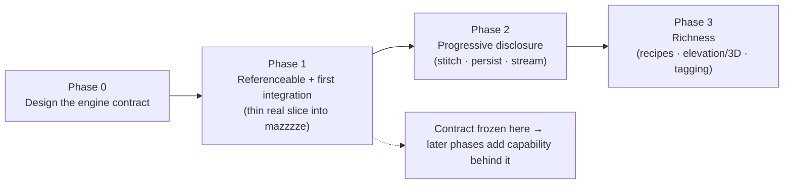

# Roadmap — PlayersWorlds.Maps as the maze engine for the game

> **Date:** 2026-07-05 · **Status:** Active plan; work continues in a new chat.
> **This is the durable handoff.** A fresh session should read, in order: this ROADMAP → [PRD.md §1.2 world model](PRD.md#12-world-model--persistence-lifecycle) → [SCENARIOS.md](SCENARIOS.md) → [API-FIT.md](API-FIT.md). Everything needed to resume is in §7–§9 below.

---

## 1. The world model (decided)

The game (`mazzzze`) is an MMO with a **progressively-disclosed, persisted, shared** map. The map engine's model:

- **Stateful & persisted, generate-once-share.** A region is generated *once* when first visited, then becomes static persisted state. Every later visitor loads that stored map — it is **never regenerated**. (Not a pure function of coordinates.)
- **Independent generation + seam-stitching (NOT same-seed tiling).** Each region is a fresh generation with its *own* seed. On creation it must **connect** (entrance↔entrance) to any already-generated neighbors it touches. Separate maps joined at seams — not slices of one big maze.
- **Mutation lifecycle.** In-place changes (plant/cut a tree) persist and are shared across players. The **game** owns mutation state; the **engine** owns the stable region+cell identity the game keys mutations to.

Full detail + lifecycle diagram: [PRD.md §1.2](PRD.md#12-world-model--persistence-lifecycle).

---

## 2. Organizing principle: contract-first, capability-progressive

The engine exposes **one API contract** designed to survive the whole evolution to MMO. We design that contract *fully* up front, **freeze it at first integration**, then fill capability in behind it — so `mazzzze` never has to change the code it calls.

This reconciles the two constraints: *integrate as early as possible* **and** *get the long-term contract right*.

---

## 3. Phases

### Phase 0 — Design the engine contract *(design only)*
**Goal:** define the interface `mazzzze` (and any consumer) codes against, built to outlast the MMO evolution. **Exit criteria:** an approved contract spec covering §6 below. **No integration yet.**

### Phase 1 — Referenceable + first integration *(earliest end-to-end)*
**Goal:** `mazzzze` renders a *real* library maze instead of its `IsFloor` hash.
- **P5** — multi-target the core library `net472;net8.0` so Godot 4 can reference the DLL (the first domino; core already proven to compile on modern .NET).
- Implement the **minimum** of the contract: generate a single region + return renderable cell data + entrance/exit/dead-end metadata.
- Integrate: replace `MazeData.IsFloor` with a call into the library behind the contract; `mazzzze`'s existing `ChunkManager` samples the region into its `GridMap` chunks.
- Fix the traps that bite integration: the `Serialize()` non-round-trip (D5) and the **longest-path mis-tagging** (S6/§9 — `mazzzze` relies on a fixed entrance/exit).
- **Deferred here:** multi-region, stitching, persistence, streaming.
**Exit criteria:** player walks a real, solvable library-generated maze in `mazzzze`, with a correct entrance/exit.

### Phase 2 — Progressive disclosure *(behind the frozen contract)*
**Goal:** grow the world outward as a persisted, connected MMO map.
- **P3 seam-stitching** (core): generate a new region that connects to persisted neighbors.
- **P2 region store & addressing** (core): generate-once → persist → load-many; `IRegionStore` implemented game-side.
- **P1 coordinate-addressed region generation**; **P4 stable region/cell identity** (for mutations S7 + fog-of-war).
- Streaming/eviction (chunk facade, C3) as a *deferred* add-on behind the same façade.
- **S5** country-merge is post-v1.
**Exit criteria:** two independently-generated regions persist and connect; a mutation persists and is visible to a second visitor.

### Phase 3 — Richness
**Goal:** enrichment as options on the stable contract.
- Map-type recipes (the "cookbook": corridor / room-and-corridor dungeon / true maze / 3D ideation).
- Elevation / 3D; environment/biome tagging; area-distribution tuning (D6); tile-mapping guide (C2).

---

## 4. Journey → phase map

| Phase | Journeys ([SCENARIOS.md](SCENARIOS.md)) |
|-------|------------------------------------------|
| 0 (design) | *informs all* — esp. S1, S2, S3, C2, C4, C5, S7 |
| 1 (integrate) | **C1** local gen, **C2** consume/render, **S6** metadata; dev **D1–D5** already work; fix D5/S6 bugs; **P5** .NET target |
| 2 (MMO) | **S2** stitch, **S3** persist, **S1** region factory, **S4** consistency-via-persistence, **C4** identity, **S7** mutation identity, **C5** pathing; **C3** stream (deferred); **S5** post-v1 |
| 3 (richness) | **D6** tuning + cookbook, elevation/3D, environment tagging, C2 tile-mapping guide |

---

## 5. mazzzze integration (the Phase 1 step, in detail)

**Baseline today** (`/home/data/repos/github.com/vasiliy-kiryukhin/mazzzze`, Godot 4 / net8.0):
- Map = a **stateless coordinate hash**, `MazeData.IsFloor(wx,wz)`: odd/odd cells are corridors; walls between them open 70% via a hash; pillars 5%. Fixed entrance `(1,0)` / exit `(W-2,H-1)`. 10000×10000, cell 3.6u, walls 30u.
- `ChunkManager` streams `chunk.tscn` (`GridMap` + `MazeTiles.tres`) in 16×16 chunks around the player; `Minimap.cs`/`MinimapState.cs` do fog-of-war.
- **No reference to `PlayersWorlds.Maps`; no copied code.** It reinvented a simpler, non-solvable lattice.

**Integration shape (Phase 1):** the library becomes the source of the region; `mazzzze` keeps its renderer/streamer.
- Library generates a bounded region (real maze: guaranteed solvable, rooms/halls/caves, real dead-ends and a true longest-path exit).
- `MazeData` calls the library behind the contract; `ChunkManager` samples cells for each `GridMap` chunk exactly as it samples `IsFloor` today.
- Chunking is *not* the library's job in Phase 1 — `mazzzze` already chunks; it just needs the contract to answer "what's the map here."

**What the player gains:** a coherent, solvable maze with rooms and a meaningful entrance/exit instead of a random 70% lattice.

---

## 6. The contract (what Phase 0 must define)

The single interface `mazzzze` codes against, designed to leave room for later phases:

1. **Region address + generate-once + persistence hook** — a coordinate-addressed factory (P1) and an `IRegionStore` seam (P2) so the game persists; the engine never regenerates.
2. **Renderable cell data** — per cell: floor/wall, tags (wall/trail/…), links, and POI metadata (dead-ends, entrance/exit). Note tags require Block conversion (`ToMap`) — see [API-FIT finding #2](API-FIT.md#notable-findings-from-validation).
3. **Seam/border connection** (P3) — generate a region that connects to already-persisted neighbors.
4. **Stable region + cell identity** (P4) — survives load/unload so the game keys mutations (S7) and fog-of-war to it.
5. **Query surface** — connectivity/pathing (`DijkstraDistance.Find/Solve` are public today; wrap per-region).
6. **Explicitly leaves room for (not required yet):** streaming/eviction, elevation/3D, environment tagging.

**Phase 0's crux is settled:** the model is stateful/persisted with independent-gen + stitch (§1). Remaining Phase-0 work is shaping the concrete contract surface above and where it lives (core `src` vs. a new façade assembly).

---

## 7. Current state (for resume)

- **Sub-project B is DONE.** Deliverables on branch `docs/project-documentation` → **PR #40** (`github.com/krmrn42/maze-gen`, base `main`):
  - `docs/PRD.md`, `docs/DESIGN.md`, `docs/COMPONENT-REVIEW.md`, `CLAUDE.md` (baseline docs)
  - `docs/SCENARIOS.md`, `docs/API-FIT.md` (scenario catalog + validated API-fit + proposals)
  - `docs/ROADMAP.md` (this file)
  - `docs/superpowers/specs/2026-07-05-scenarios-api-fit-design.md`, `docs/superpowers/plans/2026-07-05-scenarios-api-fit.md`
- **maze-gen:** .NET Framework 4.7; **mono not installed locally** — the library was validated by compiling `src/**/*.cs` as a DLL and running snippets on **.NET 10** (probe in the session scratchpad, `apifit-probe` + `mazelib`). 13/13 scenarios validated; see [API-FIT validation log](API-FIT.md#validation-log). The `circles` branch has an unrelated in-progress refactor — **untouched**.
- **mazzzze:** `/home/data/repos/github.com/vasiliy-kiryukhin/mazzzze`, Godot 4 (`Godot.NET.Sdk/4.7`), **net8.0** — see §5.

---

## 8. Decision log

| Decision | Resolution |
|----------|------------|
| Statefulness | **Stateful & persisted**, generate-once-share (not a coordinate pure-function) |
| Region generation | **Independent per region (own seed) + seam-stitch**; NOT same-seed tiling |
| Coordinate-determinism | **Demoted** — only for first-gen reproducibility; consistency comes from persistence |
| Chunking / streaming | **Deferred** — not needed for integration (mazzzze already chunks) |
| Integration timing | **As early as possible**, on a right-shaped (frozen) contract |
| Mutations (tree plant/cut) | **Game owns state; engine owns stable identity** to key it to |
| .NET target | **Multi-target `net472;net8.0`** (Phase 1, proven to compile) |
| Docs shape | Scenarios spine = **runtime actor**; two docs (SCENARIOS + API-FIT); B includes API sketches |
| Sub-project sequencing | Was B→C→D; now reframed into this **phased roadmap** (C = Phase 3 cookbook; D = Phases 0–2 engine) |

---

## 9. Next actions (immediately resumable in a new chat)

1. **Brainstorm Phase 0 — the engine contract** (superpowers:brainstorming). Resolve the concrete contract surface (§6): the region factory + `IRegionStore` shape, the renderable cell-data type, the seam representation, stable identity, and whether it lives in core `src` or a new façade assembly. Output: a contract spec.
2. **Phase 1 execution:** multi-target the library (P5); implement the minimum contract; integrate into `mazzzze` (replace `MazeData.IsFloor`); fix the D5 `Serialize()` trap and the S6 longest-path mis-tagging.
3. **Phase 2:** seam-stitching (P3) → region store (P2) → identity (P4), behind the frozen contract.
4. **Phase 3:** cookbook recipes, elevation/3D, tagging.

**Open questions for Phase 0:** contract home (core vs new assembly); exact seam/border representation for independent-seed regions; how region identity encodes into cell coordinates for mutation keying; bounded-region size for the Phase 1 integration.

---

## References
- PR #40: `https://github.com/krmrn42/maze-gen/pull/40`
- Docs: `docs/{PRD,DESIGN,COMPONENT-REVIEW,SCENARIOS,API-FIT,ROADMAP}.md`, `CLAUDE.md`
- Spec/plan: `docs/superpowers/specs/…`, `docs/superpowers/plans/…`
- Game: `/home/data/repos/github.com/vasiliy-kiryukhin/mazzzze` (Godot 4, net8.0)
- Validation harness (scratchpad, not committed): net10 probe referencing `src` as `PlayersWorlds.Maps.dll`
